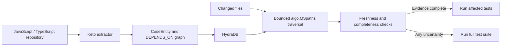

# Keto

[](https://github.com/CryptoZephyr/keto/actions/workflows/ci.yml)
[](https://github.com/CryptoZephyr/keto/actions/workflows/hydra-verify.yml)

**Keto tells coding agents which tests a code change can affect, and shows the dependency paths that justify the answer.**

It extracts a file-level JavaScript and TypeScript dependency graph, stores that graph in [HydraDB](https://github.com/hydra-db/hydradb), and uses HydraDB's `algo.MSpaths` procedure to trace a changed file back to the tests that depend on it.

Keto only selects tests when it can prove that the graph and traversal result are complete. If HydraDB is unavailable, the graph is stale, an import cannot be resolved, or any safety check fails, Keto runs the full test suite.

## The problem

Coding agents make changes quickly, but they still need a trustworthy answer to a basic question: **which tests should run now?**

Running every test is safe but slow. Choosing a few tests by filename or semantic similarity is faster, but it can miss indirect dependencies. Code already has a better source of evidence: its dependency graph.

If `session.test.ts` imports `session.ts`, and `session.ts` imports `auth.ts`, then a change to `auth.ts` can affect that test even when their names and contents are not similar:

```text
tests/session.test.ts --DEPENDS_ON--> src/session.ts --DEPENDS_ON--> src/auth.ts
```

Keto stores these relationships in HydraDB and traverses them in reverse from the changed file. The result is a list of affected tests plus the paths that connect each test to the change.

## What Keto does

Keto has three commands:

```text
keto index   --repo <path>
keto explain --repo <path> --base <git-ref> [--json] [--changed <file>]
keto test    --repo <path> --base <git-ref> [--dry-run] [--json] [--changed <file>]
```

- `keto index` parses the repository and replaces its current `CodeEntity` graph in HydraDB.
- `keto explain` finds the files and tests affected by a change and prints the dependency-path evidence.
- `keto test` runs the selected Jest or Vitest files. When the evidence is incomplete, it runs the full suite and explains why.

`--changed` is useful for fixture demos and CI overrides. Normal repository use compares against a Git ref with `--base`.

## How it works



Each source or test file becomes a `CodeEntity` vertex. Static imports become directed `DEPENDS_ON` relationships with stable identity, relationship kind, and import specifier metadata.

For an impact query, Keto:

1. Finds the changed entities by stable key.
2. Calls HydraDB's bounded, multi-source `algo.MSpaths` traversal over incoming `DEPENDS_ON` relationships.
3. Converts the returned paths into affected files and tests.
4. Re-reads the graph before and after traversal.
5. Selects tests only if the stored hashes, identity version, counts, topology, and returned paths match the current repository extract.

## Where HydraDB is used

HydraDB is not a decorative dependency. It performs the work that makes Keto graph-native:

- Persists `CodeEntity` vertices and `DEPENDS_ON` relationships.
- Accepts bounded Bolt `UNWIND` mutations with idempotency metadata.
- Looks up changed files by stable identity.
- Executes the incoming dependency traversal with `algo.MSpaths`.
- Returns the path evidence shown by `keto explain` and used by `keto test`.
- Supports graph read-back so Keto can reject stale or changing state.

### What Keto loses without HydraDB

Without HydraDB, Keto can still parse a repository, but it cannot persist the graph, retrieve dependency paths, prove that the stored graph is current, or select tests. It therefore fails closed and runs the full suite.

Keto uses the pinned image `ghcr.io/hydra-db/hydradb:0.1.1`. The upstream commit reviewed for API compatibility is `6a2fbb192f37f51a93690a2ae2d2f5e27e6e4219`.

## Safety policy

Skipping a relevant test is worse than running too many, so selected-test mode has a strict gate.

Keto runs the full suite when it sees any of the following:

- A changed file is missing or was not indexed.
- A source file has a parse error, unresolved import, or non-literal dynamic import.
- A lockfile, root configuration, test configuration, or shared tool changes.
- HydraDB is unavailable, rejects the query, times out, or exceeds a traversal budget.
- Vertex hashes, identity version, counts, or relationship topology are stale.
- HydraDB returns missing, unexpected, truncated, or suspiciously empty path evidence.
- The result approaches the configured depth, path-count, result, or execution limit.

The local extractor can enumerate its own topology to verify HydraDB's answer, but Keto never uses that local enumeration as substitute evidence for selected-test mode.

## Quick start

### Requirements

- Node.js 20 or newer
- Docker or another environment capable of running the pinned HydraDB image
- Ports `7687`, `8443`, and `9090` available on loopback

GitHub Codespaces is a practical option when the local machine cannot comfortably run HydraDB. The setup script keeps every HydraDB port bound to `127.0.0.1`.

### Install and verify

```bash
npm ci
cp .env.example .env
bash scripts/start-hydradb.sh
node scripts/hydra-proof.mjs
npm test
```

The proof checks `/readyz`, performs an HTTP write/read round trip, and confirms Bolt connectivity without printing the auth token.

### Try the known-answer fixture

```bash
npm run keto:index -- --repo fixtures/monorepo
npm run keto:explain -- --repo fixtures/monorepo --changed src/util.ts
npm run keto:test -- --repo fixtures/monorepo --changed src/util.ts --dry-run
```

Stop HydraDB when finished:

```bash
bash scripts/stop-hydradb.sh
```

`keto index` replaces the existing `CodeEntity` subgraph. In this MVP, one repository should own one HydraDB graph and namespace.

## GitHub Actions

Keto also works as a repository workflow. The checked-in workflow:

1. Starts the pinned HydraDB service on loopback.
2. Indexes the checked-out repository.
3. Explains the impact of the requested change.
4. Validates the emitted report.
5. Runs selected tests only when the report proves selected mode; otherwise it runs `npm test`.

The latest checked-repository run indexed 62 vertices and 96 relationships, verified that the stored graph matched the extract, and completed all 53 tests through the fail-closed runner.

- [Live HydraDB verification](https://github.com/CryptoZephyr/keto/actions/runs/31962379159)
- [Checked-repository Keto run](https://github.com/CryptoZephyr/keto/actions/runs/31962451715)
- [Standard CI](https://github.com/CryptoZephyr/keto/actions/runs/31962379156)

The HydraDB workflow separately proves repeated indexing, stale-graph replacement, relationship metadata, selected traversal on a warning-free fixture, `algo.MSpaths` query bounds, and full-suite fallback on unsafe input.

## Known-answer fixture

`fixtures/monorepo` covers direct, two-hop, and four-hop dependencies, an unaffected test, a dependency cycle, path aliases, dynamic imports, non-literal `require`, and root-configuration changes.

The original fixture intentionally contains unsafe imports, so every change falls back to the full suite. The live HydraDB workflow creates a warning-free copy to prove selected traversal, then returns to the original fixture to prove conservative fallback behavior.

Expected graph identities and impact cases live under `fixtures/expected` and `fixtures/monorepo/keto.fixture.json`.

## Current scope

- File-level JavaScript and TypeScript dependency graphs
- Static relative imports and configured TypeScript/JavaScript path aliases
- Jest and Vitest execution
- One repository per HydraDB graph/namespace
- CLI and GitHub Actions interfaces; no hosted frontend or API is required

Keto does not claim measured speed, scale, accuracy, or CI savings yet. The measurement requirements and current evidence boundary are documented in [`docs/BENCHMARKS.md`](docs/BENCHMARKS.md).

## License and attribution

Keto is available under the [MIT License](LICENSE).

HydraDB runs as an external AGPL-3.0 service and is not vendored into this repository. Third-party packages, licenses, and roles are listed in [`THIRD_PARTY.md`](THIRD_PARTY.md).
