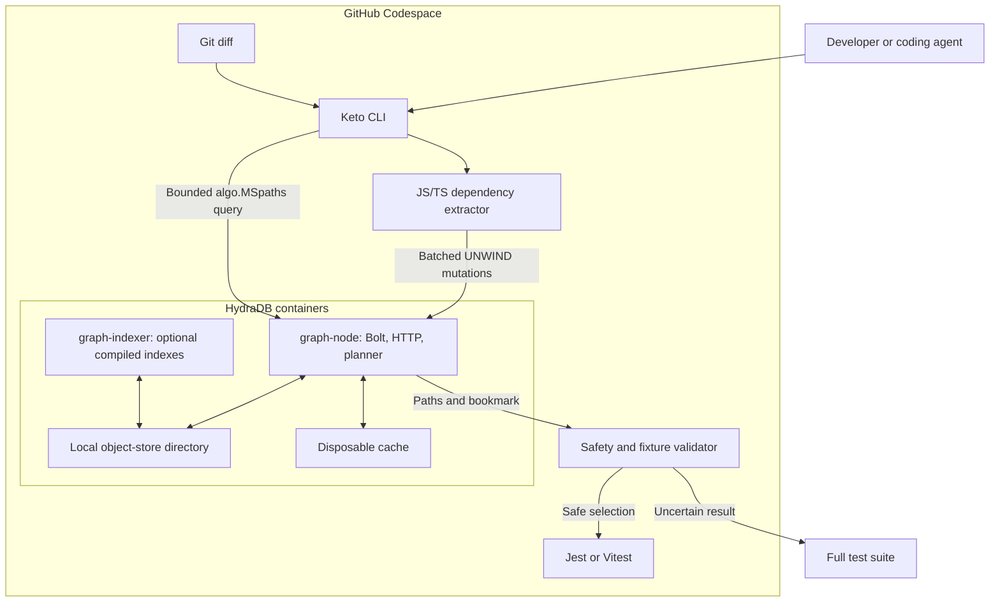
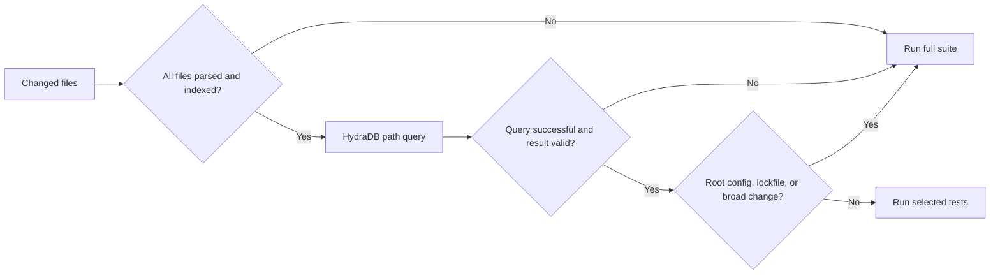

# System Architecture — Keto

**Project:** Keto  
**Track:** Hack Hydra 2026 Track 02  
**Database:** HydraDB through Bolt 5.x or the HTTP query API  
**Development environment:** A small GitHub Codespace; the local 4 GB laptop only displays the browser editor

---

## 1. Runtime Topology



The containers run inside Codespaces, not on the local laptop. Keto and HydraDB communicate over the Codespace loopback network, so no database port or development token needs to be exposed publicly.

---

## 2. Graph Model

HydraDB requires non-negative integer node IDs. Keto therefore separates durable identity from display properties.

### Vertex

```text
(:CodeEntity {
  id: Integer,
  stable_key: String,
  repository: String,
  path: String,
  kind: "file" | "test",
  language: String,
  content_hash: String
})
```

`id` is derived deterministically from a versioned hash of:

```text
repository identity + normalized repository-relative path + entity kind
```

The implementation must detect hash collisions and fail the index operation instead of silently aliasing two entities.

### Relationship

```text
(:CodeEntity)-[:DEPENDS_ON {
  id: Integer,
  stable_key: String,
  kind: "imports" | "tests",
  specifier: String
}]->(:CodeEntity)
```

Direction is always “source depends on destination”:

- `a.ts -[:DEPENDS_ON {kind: "imports"}]-> b.ts` means `a.ts` imports `b.ts`.
- `a.test.ts -[:DEPENDS_ON {kind: "tests"}]-> a.ts` means the test covers or imports `a.ts`.

Using one relationship type is intentional. HydraDB's current Cypher subset accepts one relationship type per pattern, so dependency subtypes are properties rather than separate traversed relationship types.

---

## 3. Ingestion

Keto uses Bolt transport-level `UNWIND` parameters for mutation batches. A vertex upsert matches on `id` and sets other properties afterward:

```cypher
UNWIND $rows AS row
MERGE (n {id: row.id})
SET n:CodeEntity,
    n.stable_key = row.stable_key,
    n.repository = row.repository,
    n.path = row.path,
    n.kind = row.kind,
    n.language = row.language,
    n.content_hash = row.content_hash
```

Relationships are created or merged only after both endpoint vertices exist:

```cypher
UNWIND $rows AS row
MATCH (source:CodeEntity {id: row.source_id}),
      (destination:CodeEntity {id: row.destination_id})
MERGE (source)-[r:DEPENDS_ON {id: row.relationship_id}]->(destination)
SET r.stable_key = row.stable_key,
    r.kind = row.kind,
    r.specifier = row.specifier
```

Batches go through Bolt, not HydraDB's scalar-only in-process shard API. Keto sends a deterministic `hydradb.idempotency_key` in Bolt transaction metadata and uses small bounded batches so a retry resolves to the original mutation rather than duplicating graph data. HTTP remains useful for health checks, setup proof, and bounded queries, but its current public request body does not expose a caller-supplied mutation idempotency field.

---

## 4. Impact Query

The previously proposed mixed-type Cypher pattern and general `MATCH path = ...` projection are not supported by HydraDB. Keto instead uses the native multi-source path procedure.

For changed files with stable keys `repo:src/auth.ts:file` and `repo:src/user.ts:file`, Keto generates a safely escaped literal-list query:

```cypher
CALL algo.MSpaths({
  sourceLabel: 'CodeEntity',
  sourceProperty: 'stable_key',
  sourceValues: ['repo:src/auth.ts:file', 'repo:src/user.ts:file'],
  relTypes: ['DEPENDS_ON'],
  relDirection: 'incoming',
  maxLen: 4,
  pathCount: 20,
  resultLimit: 500
})
YIELD path
RETURN path
```

HydraDB currently requires `sourceValues` and `relTypes` to be literal string lists in this procedure configuration. The query builder must therefore escape single quotes and backslashes, reject control characters, and enforce maximum source-list and query-size limits. Scalar values elsewhere remain parameterized.

Keto reads the returned path nodes, retains paths ending at vertices where `kind = "test"`, deduplicates their `path` properties, and displays the structural evidence. `maxLen`, `pathCount`, `resultLimit`, HydraDB's request timeout, and Keto's own maximum-selected-tests threshold keep the operation bounded.

---

## 5. Consistency and Indexing

- Each impact query uses HydraDB's snapshot-consistent read and records the returned bookmark/read epoch in debug output.
- Initial correctness tests run without depending on a compiled index; HydraDB can fall back to canonical snapshot reads.
- `graph-indexer` is enabled for the final graph-native performance demonstration only after the baseline is correct.
- Because current HydraDB issues report inconsistent bounded traversal when a compiled index lags behind the WAL, Keto validates known-answer scenarios and falls back to the full suite whenever validation or query execution is uncertain.
- Benchmark ingestion and benchmark querying are separate phases. The benchmark waits for indexing activity to settle and performs no concurrent mutations during timed queries.

---

## 6. Safe Decision Policy



Keto never interprets “no paths found” as automatically safe. For a non-trivial source change, an empty result causes a full-suite run unless a checked-in policy explicitly declares that path test-independent.

---

## 7. Benchmark Method

Every performance result must report:

- HydraDB image tag and commit, if known;
- Codespaces machine size;
- vertex and relationship counts;
- fixture or repository commit;
- cold versus warm query state;
- whether `graph-indexer` was running and settled;
- full-suite duration;
- selected-suite duration;
- ingestion duration; and
- median plus p95 HydraDB query duration across repeated runs.

No “sub-millisecond,” “sub-second,” accuracy, scale, or savings claim is made until this procedure produces the evidence.
